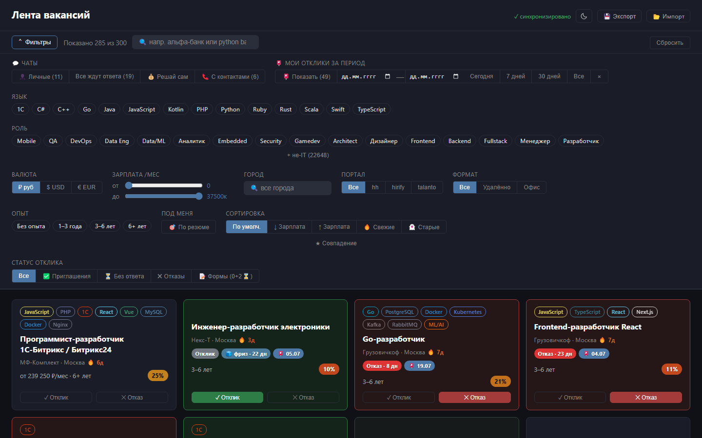
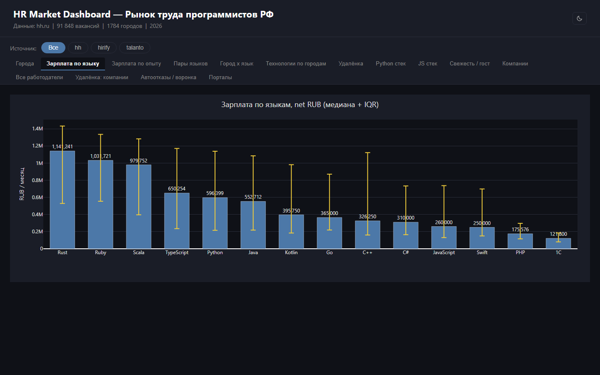

# HH Job Market Analyzer

[](https://github.com/kaxaru/Job-parser/actions/workflows/ci.yml)
[](https://www.python.org/)
[](docs/testing.md)
[](ruff.toml)

Агрегатор IT-вакансий с **9 порталов** (hh.ru, hirify.me, talanto.work, getmatch.ru,
arbeitnow.com, himalayas.app, web3.career, themuse.com, jobicy.com): сбор -> аналитика ->
интерактивный дашборд и лента-CRM с фильтрами под резюме и автооткликами через Playwright.

Локальная однопользовательская система на Windows. Хранилище — JSON-файлы;
PostgreSQL нужен только опциональному полнотекстовому поиску.

В составе репозитория — портфолио-подпроект [`dwh_demo/`](dwh_demo/README.md):
ETL (Ports & Adapters) в три хранилища **PostgreSQL / ClickHouse / MS SQL** -> BI в Metabase
-> оркестрация Airflow -> observability Grafana + Loki.

## Как выглядит

Лента-CRM: карточки с бейджами совпадения и свежести, статусом отклика с HH, состоянием
переписки; фильтры сворачиваются в липкую полосу, тема переключается в шапке.

<picture>
  <source media="(prefers-color-scheme: light)" srcset="docs/img/feed-light.png">
  
</picture>

Дашборд: вкладки Plotly со срезами по каждому порталу.

<picture>
  <source media="(prefers-color-scheme: light)" srcset="docs/img/dashboard-light.png">
  
</picture>

> Скриншоты следуют теме GitHub. Пересборка — `python tools/make_screenshots.py`: срез
> реальных вакансий со всех порталов, **CRM-слой синтетический** (отклики, отказы
> и переписка генерятся детерминированным сидом — реальная история в репозиторий не попадает).

## Возможности

- **Сбор** — девять порталов параллельно, дедуп внутри портала и кросс-портальный.
  Санити-гейт не даёт деградированному срезу затереть кеш.
- **Свежесть** — возраст по `creationTime` против `publicationTime` отделяет живые вакансии
  от гост-вакансий, которые месяцами переоткрывают. Бейдж в ленте, отсев в автоклике.
- **Аналитика и дашборд** — зарплаты по языкам, опыту и городам, топ-стеки, доля удалёнки,
  воронка автоотказов. CSV плюс интерактивные вкладки Plotly.
- **Лента-CRM** — все вакансии карточками: фильтр «по резюме», бейдж совпадения, реальный
  статус отклика с HH (отказ / приглашение / интервью), сопроводительные письма, поиск,
  режим «Мои отклики за период».
- **Классификация переписки** — кто ответил: человек, шаблонная рассылка или бот; фильтр
  «ждут ответа». Практический эффект — из 600 чатов остаётся 23 реальных дела.
- **Автоотклики** — по расписанию, с дневным лимитом и трёхуровневым отбором кандидатов.
- **Отклик из ленты** — кнопка «Откликнуться в фоне» под `hh.py serve`: сервер жмёт кнопку
  через Playwright и шлёт письмо сообщением в чат.

## Быстрый старт

Docker для ядра **не нужен**: лента, сбор, автоклик, дашборд и аналитика работают на
JSON-хранилище. Он нужен только серверному поиску и подпроекту `dwh_demo/`.

После клона нет каталогов `data/`, `logs/`, `personal/` и файлов `.env`,
`resume_profile.json` — они в `.gitignore` и создаются вами или кодом.

### 1. Окружение

```bash
python -m venv .venv3 && .venv3\Scripts\activate   # bash: source .venv3/Scripts/activate
pip install -r requirements.txt
python -m playwright install chromium              # нужен автокликам
```

### 2. Секреты — `.env` в корне

```bash
copy .env.example .env                             # bash: cp .env.example .env
```

Обязательны только два: **`HH_EMAIL`** и **`HH_PASSWORD`**. Всё остальное — опционально
и по умолчанию выключено; полный список — [`docs/config.md`](docs/config.md).

### 3. Профиль резюме — `resume_profile.json`

```bash
copy resume_profile.example.json resume_profile.json   # bash: cp
```

Файл в `.gitignore`: внутри гражданство, вуз, стаж и факты для ответов рекрутёрам. Шаблон
остаётся под контролем версий, чтобы структура не потерялась, и все пояснения лежат прямо
в нём — комментариями у каждого ключа.

Минимум для работы:

- **`core`** — технологии-ядро, хотя бы одна должна быть в вакансии; единый источник
  для автоклика и скоринга ленты
- **`exp_ids`** — уровни опыта: `noExperience`, `between1And3`, `between3And6`, `moreThan6`
- **`answers`** — факты для ответов бот-рекрутёрам. Строго по резюме: движок отвечает только
  отсюда, а при отсутствии факта молчит и отдаёт вопрос человеку

Остальные ключи (блеклисты, тиры отбора, поисковые запросы и города, тексты писем, ответы
на анкеты) необязательны — у каждого свой дефолт. Разбор — [«Под своё резюме»](#под-своё-резюме).

Без файла система стартует на дефолтах из `config.py`, но шаблонные ответы в чатах молчат:
фактов нет.

### 4. Резюме прозой — `personal/resume.md` (нужен только анкетам)

Каталог `personal/` в `.gitignore`. Файл читает `form_fill.py` как семантический контекст
при LLM-заполнении анкет-опросников; ПДн из него вычищаются перед отправкой провайдеру.
Не нужен, если `FORMS_LLM` выключен — а он выключен по умолчанию.

### 5. Вход и первый прогон

```bash
python hh.py autoclick --login    # разово: окно, капча руками -> сессия в data/browser_profile/
python hh.py collect              # первый сбор (data/ после клона пуст)
python hh.py analyze
python hh.py feed
python hh.py serve                # http://127.0.0.1:8000/
```

## Команды

```bash
python hh.py collect [--force]      # собрать вакансии -> data/vacancies_raw.json
python hh.py enrich [--only-empty]  # догрузить карточки
python hh.py analyze                # отчёты -> data/reports/*.csv
python hh.py dashboard              # -> data/dashboard.html
python hh.py feed                   # -> data/feed.html
python hh.py serve [--port N]       # сервер: лента + отметки + /api/apply + поиск
python hh.py autoclick [флаги]      # Playwright: поднятие резюме + автоотклики
python hh.py chat [флаги]           # автоответы в переписке (без --send — только показать)
python hh.py forms [флаги]          # форм-очередь: --dry-run / --sweep / --clean / дренаж
python hh.py hhapi --login|--probe  # официальный API hh.ru: OAuth и проверка прав
python hh.py [all] [--force]        # collect + analyze
```

> ⚠ `--force` обходит санити-гейт, защищающий кеш от затирания деградированным срезом.
> Только руками и только когда точно известно, что спад реальный —
> [`docs/collect.md`](docs/collect.md).

## Автокликер

```bash
python hh.py autoclick --login                    # разово: вход с окном, капча руками
python hh.py autoclick --apply-limit 1 --headed   # один отклик, глазами
python hh.py autoclick --sync-status              # статусы и чаты, без браузера
```

Флаги: `--apply-limit N` за запуск · `--daily-cap N` в сутки · `--cover template|llm` ·
`--headed` · `--bump-only` / `--apply-only` · `--sync-status`. Эффективный лимит запуска —
`min(apply-limit, дневной остаток)`, поэтому несколько мелких запусков за день не превысят
дневной cap.

**Капча.** На логине HH почти всегда просит подтвердить, что вы не робот. Это проходится
руками один раз в окне `--login` и не автоматизируется by design; дальше сессия живёт
в persistent-профиле Chromium, и крон идёт headless неделями.

**Письмо** уходит сообщением в чат после отклика, а не в модалку: у чата нет
фингерпринт-гейта Group-IB.

Отбор кандидатов, watchdog, lock и квота — [`docs/apply.md`](docs/apply.md).

## Опционально

Каждый слой независим и по умолчанию выключен.

- **LLM-фичи.** В `.env` ключ плюс флаг: `INTENT_LLM=1` (классификатор намерения в чатах),
  `REPHRASE_LLM=1` (переформулировка одобренного факта), `FORMS_LLM=1` (заполнение анкет),
  `--cover llm` для писем. Без ключа и флага сеть не трогается: движок работает на regex
  и дословных фактах профиля. Границы приватности — [`docs/security.md`](docs/security.md).
- **Серверный поиск (PostgreSQL FTS).** Прод-путь «строка -> backend -> `tsvector` ->
  ранжированная выдача», в отличие от клиентского фильтра ленты:

  ```bash
  cd dwh_demo && docker compose up -d hh-postgres
  python dwh_demo/search_demo/load.py
  python hh.py serve                              # http://127.0.0.1:8000/search
  ```

  БД недоступна -> `503` только на `/api/search`, лента и отметки работают. Почему `tsvector`,
  а не Elasticsearch — замеры в [`dwh_demo/search_demo/`](dwh_demo/search_demo/README.md).
- **Крон (планировщик Windows)** — четыре активные задачи. На чистой машине их надо
  зарегистрировать: команды и расписание — [`docs/operations.md`](docs/operations.md).
- **JS-тулинг** — только для пересборки фронта: `esbuild`, `biome`, `node` >= 21
  (standalone-бинари, без npm-зависимостей). Без него `data/feed.js` берётся готовым.
- **Подпроект `dwh_demo/`** — свой стек и инструкция: [`dwh_demo/README.md`](dwh_demo/README.md).

## Под своё резюме

Всё настраивается в `resume_profile.json` — исходники править не нужно. Пояснения к каждому
ключу лежат в `resume_profile.example.json`, полный разбор — [`docs/config.md`](docs/config.md).

**Блеклисты** (`blacklists`) — какие вакансии не брать. Двенадцать ключей: `senior`,
`internship`, `other_engineering`, `operations`, `management`, `non_engineering`, `qa`,
`analyst`, `ml`, `devops`, `other_lang` и `target_engineering` (последний — исключение, а не запрет: снимает `analyst` и `ml`).
Значение — **список слов**, регулярки писать не нужно:

```jsonc
"blacklists": {
  "qa": [],                                   // пустой список = правило ВЫКЛЮЧЕНО
  "devops": ["sre"],                          // сузить до одного SRE
  "senior": ["staff", "principal", "ведущ*"]  // * в конце = совпадение по началу слова
}
```

Слово матчится целиком («qa» не поймает «Aqua»), хвост `*` закрывает русскую морфологию.
Правила проверяются по порядку, побеждает первое совпавшее. Кому нужен lookaround — строка
вместо списка трактуется как готовый регекс.

**Тиры отбора** — `core_wide`, `office_cities`, `extra_exp_ids`. Автоклик идёт по приоритету:
tier1 — `core` и удалёнка, tier2 — `core_wide` и удалёнка, tier3 — любой из двух стеков,
но офис и только города из `office_cities`. Тир3 — не готовность к переезду, а ставка
на переговоры: офисная по описанию вакансия в крупном городе часто допускает удалёнку.

**Что и где собирать на hh.ru** — `search_queries` и `cities` (ключ — `area id` из
[api.hh.ru/areas](https://api.hh.ru/areas)). Профиль заменяет список целиком, а не дополняет.

**Письма** — `cover_template` для крон-откликов и `feed_cover_templates` для ленты.
**Ответы на анкеты** — `form_answers` на верхнем уровне профиля; точную формулировку поля
показывает `python hh.py forms --dry`, он ничего не отправляет.

Общий контракт: **пустой список = настройка снята**, ключ отсутствует = дефолт из кода.
Исключение — `search_queries` и `cities`: там пусто уходит в дефолт, потому что «искать
нечего» это не предпочтение, а сломанный конфиг.

Известный компромисс: лента знает только `core` и покажет «не матч» вакансиям тиров 2–3,
на которые крон реально откликнется.

## Документация

Подробности по каждой подсистеме — в [`docs/`](docs/):

- [`architecture.md`](docs/architecture.md) — слои, поток данных, ключевые решения.
  **Начинать отсюда**
- [`domain.md`](docs/domain.md) — `Vacancy`, Value Objects, классификация, не-IT фильтр
- [`collect.md`](docs/collect.md) — источники, ACL, сеть, санити-гейт
- [`storage.md`](docs/storage.md) — файлы состояния, репозиторий, кеш описаний
- [`apply.md`](docs/apply.md) — тиры, отбор, watchdog, lock, квота
- [`chat.md`](docs/chat.md) — переписка, детект ботов, шаблонные ответы
- [`feed.md`](docs/feed.md) — лента (MVVM) и дашборд
- [`api.md`](docs/api.md) — HTTP-роуты локального сервера
- [`config.md`](docs/config.md) — константы, переменные окружения, все ключи профиля
- [`operations.md`](docs/operations.md) — крон, логи, диагностика
- [`errors.md`](docs/errors.md) — отказоустойчивость + каталог реальных инцидентов
- [`security.md`](docs/security.md) — секреты, XSS, анти-бот, prompt injection
- [`testing.md`](docs/testing.md) — тесты, pre-commit, критерии приёмки
- [`nfr.md`](docs/nfr.md) — нефункциональные требования

Локальные каталоги, в `.gitignore` и в клоне отсутствуют: `docs/audits/` — отчёты аудитов
(в незакрытых перечислены ещё не починенные дефекты, публиковать такое нельзя);
`docs/template/` — заготовки спеки и RFC.

Правила работы с кодом для ИИ-агентов — [`CLAUDE.md`](CLAUDE.md).
Команды разработчика (тесты, линтеры, pre-commit) — [`docs/testing.md`](docs/testing.md).

## Структура

```
hr_work/
├─ hh.py                 CLI, 11 режимов
├─ hrwork/
│  ├─ config.py          все константы и env
│  ├─ domain/            ядро: Vacancy, Value Objects, парсинг, классификация
│  ├─ application/       analyzer · funnel · apply/ (chat · forms · runtime)
│  ├─ infrastructure/    sources/ (9 порталов) · net · storage · llm · search
│  └─ presentation/      server.py + views/ (feed · dashboard · charts · reporter)
├─ src/feed/             MVVM ES-модули фронта (esbuild -> data/feed.js)
├─ templates/            Jinja: feed и dashboard (.j2)
├─ tests/                backend/ (pytest) + feed/ (node:test)
├─ tools/                check_venv (гейт pre-commit) · make_screenshots
├─ cron/                 обёртки для планировщика Windows
├─ observability/        Loki + Promtail + Grafana для крон-логов
├─ dwh_demo/             портфолио-подпроект (свой README, ruff, тесты)
└─ docs/                 документация
```
